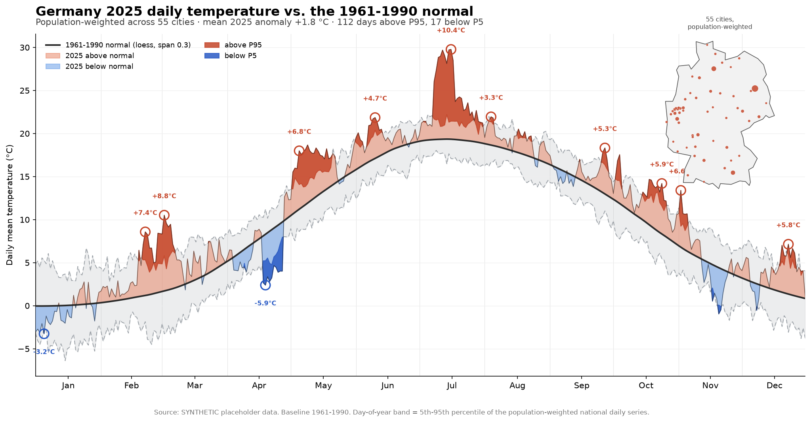

# A daily temperature normal for Germany

A Python reproduction — for **Germany** — of Dominic Roye's R analysis
[*Temperature normals for Spain with Open-Meteo*](https://dominicroye.github.io/blog/spain-temperature-normals-openmeteo/).
It builds a statistically validated daily temperature **normal** for Germany from
the **1961–1990** baseline and reads **2025** against it, with a layered fan
chart. The intellectual core is *how much to smooth* a daily climatological
reference — decided here by cross-validation, and re-derived for Germany rather
than copied from the Spanish original.

The deliverable is a self-contained **Quarto article** (`article.qmd` →
`article.html`) backed by clean, importable, unit-tested Python modules.



## Headline result

| Quantity | Value |
|---|---|
| Cities (population-weighted) | 55 |
| Baseline period | 1961–1990 (fixed; **not** WMO 1991–2020) |
| Loess span chosen by CV | **0.30**  (Spain: 0.16) |
| Harmonic order *K* chosen by CV | **3**  (Spain: 4) |
| Loess vs. harmonic normal agreement | within 0.74 °C all year |
| Baseline annual mean | 9.3 °C |
| 2025 mean anomaly vs. normal | **+1.8 °C** |
| 2025 days above historical P95 / below P5 | 112 / 17 |

Germany's flatter, more symmetric continental/maritime annual cycle — with **no
Mediterranean ocean-inertia autumn lag** — prefers *more* loess smoothing and a
*lower* harmonic order than Spain. Both facts fall straight out of the
cross-validation; neither was assumed.

> ⚠️ **Data-source note.** This repository was developed in an environment whose
> network policy **blocks the Open-Meteo archive** (and every other climate-data
> host). The numbers above and in the rendered article therefore come from a
> clearly-labelled **synthetic, physically-plausible** temperature generator, not
> from ERA5. Every method, test, cross-validation split and figure is the real
> pipeline; only the temperature *values* are stand-ins. Run it where Open-Meteo
> is reachable and the exact same code produces genuine ERA5 numbers — the data
> `source` is recorded in `data/results.json` and printed on the fan chart so the
> two are never confused.

## Pipeline

Separate, testable modules under `src/german_normals/`:

| Module | Responsibility |
|---|---|
| `locations.py` | The population-weighted table of 55 German cities (16 Bundesland capitals + largest cities), lat/lon + population weight. |
| `fetch.py` | One Open-Meteo Historical Archive call per city; parquet cache; exponential-backoff retry. **Never fabricates data.** |
| `synthetic.py` | The offline ERA5-like fallback used when Open-Meteo is blocked (shared national synoptic term + city-local term + a 2025 warm shift). |
| `build.py` | Probes Open-Meteo, falls back to synthetic, assembles the panel, records the `source`. |
| `climatology.py` | Leap-aligned day-of-year index; NaN-aware population-weighted mean/quantile; national daily series; per-day median / P5 / P95. |
| `smoothing.py` | Harmonic design matrix + OLS; `skmisc` loess fit/predict; **5-fold cross-validation split by year**; span/K selectors. |
| `figure.py` | The fan chart: P5/P95 band, salmon/blue anomaly ribbons, darker out-of-band fills, circled monthly extrema, Germany map inset. |
| `analysis.py` | One `compute_all()` entry point (with caching) shared by the CLI and the article. |

## Quick start

```bash
cd experiments/german-temperature-normals
pip install -r requirements.txt

# 1. Build the dataset, cross-validate span & K, cache every product
python run_analysis.py --fresh

# 2. Run the unit tests (pure functions, written test-first)
pytest -q

# 3. Render the article (needs Quarto: https://quarto.org)
quarto render article.qmd      # -> article.html
```

If Quarto is not installed, the analysis and figures still run; only the final
HTML render needs it. `run_analysis.py` (no `--fresh`) reuses the cache in
`data/`.

## How to get real ERA5 numbers

`build.load_panel()` automatically uses the live Open-Meteo archive whenever the
host is reachable — no code change required. In an environment with outbound
access to `archive-api.open-meteo.com`:

```bash
python run_analysis.py --fresh   # fetches + caches real ERA5 for all 55 cities
quarto render article.qmd        # data source on every figure flips to "Open-Meteo ERA5"
```

The chosen span/K and the 2025 figures will then reflect genuine reanalysis data
and may differ from the synthetic placeholders above.

## Method, in one paragraph

Pull ERA5 daily mean temperature for 55 population-weighted German cities
(1961–1990 and 2025) from Open-Meteo; collapse the cities into one
population-weighted national daily series; for each of 366 calendar days take the
median and 5th/95th percentiles over the baseline; smooth the seasonal normal
with loess **and** with harmonic regression, choosing the loess span and harmonic
order by 5-fold cross-validation **split by year**; then read 2025's daily
anomalies and band exceedances against that fixed 1961–1990 reference.

## Tests

`pytest` covers the pure functions (written red-green, test-first): the
leap-aligned day-of-year index (incl. day 366 / 29 Feb), NaN-aware weighted
mean/quantile, single-city aggregation, per-day climatology, the harmonic design
matrix, and the by-year CV fold logic (every year held out exactly once, no year
split across train/test).

## Credits

After Dominic Roye, *Temperature normals for Spain with Open-Meteo* (R) —
reproduced for Germany, in Python. Data: ERA5 via
[Open-Meteo](https://open-meteo.com/) (CC-BY 4.0) when reachable; Germany boundary
from the public `world.geo.json` dataset.
